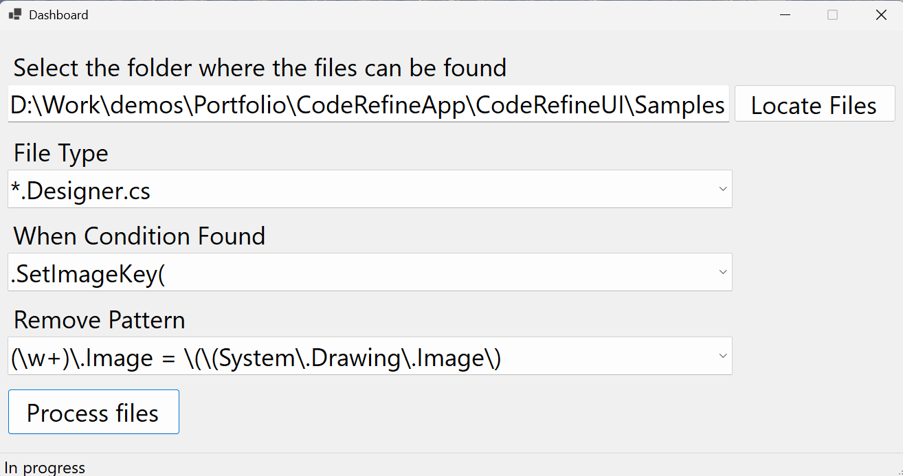

# Code Refine

Code Refine analyzes and transforms text based on custom rules. It has saved dozens of hours of manual work and proved invaluable at a critical moment—just days before the project deadline.
Ideal for situations where simple Find and Replace isn’t enough.

## Technologies Used
* C#
* .NET 8
* WinForms

## Using The App
1. Download the executable file from the release section.
2. When the application launches, it should look like this:

3. Fill in the folder path along with the rule details and hit "Process files":

4. Results 
* `button2.Image = ...` and `button2.Icon = ...` have not been removed because `imageSetter.SetImageKey(button3)` was not found
* `button3.Image = ...` and `button3.Icon = ...` have been removed due to `imageSetter.SetImageKey(button3)` on line 98

